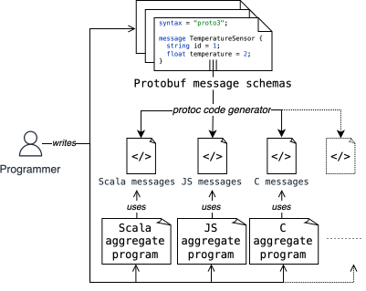
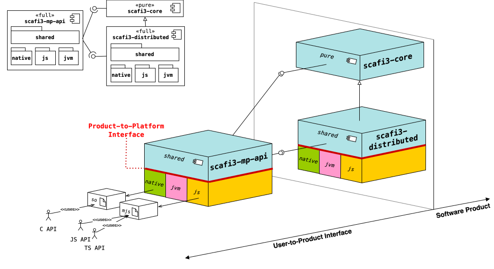

<!-- _class: invert -->

# Towards a **cross-platform**, **polyglot** implementation of _Aggregate Computing_ in ScaFi3

Luca Tassinari

<div class="smaller">

25/03/2025

<!--[_<ins>Link to ??? &#x2197;</ins>_](???)-->

</div>

---

### Motivations

<!--
Aggregate Computing reference scenario: swarm robotics and large-scale pervasive environments characterized by high densities of interconnected devices such as wearables and smartphones.
-->

- Aggregate Computing (AC) reference scenario: swarm robotics and large-scale pervasive environments (wearables, smartphones).
- Several implementations of AC exist for different programming languages to:
  - target different platforms and environments;
  - leverage unique strengths of the host programming languages;

However:

- Each of these were developed from scratch, with no code reuse and compatibility in mind;
- No common framework led to AC ecosystem fragmentation.

---

<div class="block">
  <div class="block-title">Goal</div>
  Investigate the feasibility of building a framework capable of targeting multiple   platforms while offering interoperability with other languages.
</div>

In particular the work focuses on:

- architectural design of a portable, interoperable layer for Aggregate programming, preserving core abstractions and full code reuse.
- interoperability and distribution strategies enabling seamless data exchange and collective execution across heterogeneous devices and language runtimes;
- evaluation of performance, API idiomaticity, and maintenance effort.

$\Rightarrow$ _Scala 3_ as the perfect fit to implement AC abstractions and model in a strongly typed internal DSL.

---

### Scala 3 cross-platform capabilities

_Primary target_: **JVM** (desktop, server, Android) \& _Java_ interop;

| Target         | Supported environment                                    | Language interop                              | Ecosystem maturity | Toolchain maturity |
| -------------- | -------------------------------------------------------- | --------------------------------------------- | ------------------ | ------------------ |
| **JavaScript** | browser, <br/> Node.js, <br/> WebAssembly*               | _JS_ via annotations, _TypeScript_ indirectly | Mature             | Mature             |
| **Native**     | <br/> x86-64, <br/> aarch64, <br/> 32-bit architectures* | _C_                                           | Growing            | Developing         |

_Note_: Scala Native <ins>cannot</ins> target microcontrollers! SoC like _Raspberry Pi_ are supported instead.

<div class="smaller">

$^*$ Experimental support

</div>

---

### Contribution

The contribution of this thesis span three main axes:

1. **Add a cross-platform _distribution_ module;**

2. Add support for a general _cross-platform_ and _polyglot_ serialization binding;

3. Add a _cross-platform_, _polyglot_ library abstraction layer.

---

<div class="cols">
<div class="flex-3">

#### Cross-platform distribution module

- Technology: _stream_, _TCP_-based _connection-oriented sockets_;
  - Each device is bound to a specific _endpoint_ (IP + port);
  - Point-to-point connections between neighbors;
  - Neighborhood is statically _fixed_ at initialization but can be extended in the future with dynamic discovery strategies;
- Support for multiple platforms: _JVM_, _JS_ (Node.js), _Native_;
  - _JVM_ + _Native_ support via Java Standard _sockets_ library;
  - _JS_ support via _Node.js net_ module using Scala.js type facades;
  - **Implications**:
    - shared code cannot perform blocking operations;
    - all the API is designed to be asynchronous and non-blocking;
    - primary goal: write as much shared code as possible, minimizing platform-specific implementations.

</div>
<div class="flex-1">


</div>
</div>

---

Simplified class diagram of the socket-based distribution module:

<div class="full-image">


</div>

---

An example of Scala.js facade over the Node.js `Net` class to allow interoperability with Node.js networking APIs:

```scala
@js.native
@JSImport("net", JSImport.Namespace)
object Net extends js.Object:

  /** A factory function which creates a new Socket connection. */
  def connect(port: Int, host: String): Socket = js.native

  /** A factory function which creates a new TCP or IPC server. */
  def createServer(connectionListener: js.Function1[Socket, Unit]): Server = js.native
```

---

### Contribution

The contribution of this thesis span three main axes:

1. Add a cross-platform _distribution_ module;

2. **Add support for a general _cross-platform_ and _polyglot_ serialization binding;**

3. Add a _cross-platform_, _polyglot_ library abstraction layer.

---

#### Serialization binding


---

- Devices exchange (ID, Value Tree) pairs;
- When exchanging data, values are inserted into the Value Tree encoded using a specific serialization format
  - This is possible since, in the context of an `exchange`, the type information of the value is known
- When receiving data, the Value Tree is decoded but values remain encoded in their serialized format
- Only when the corresponding exchange in the aggregate program is evaluated the value is decoded 
  - Again, this is possible since the type information of the expected value is known at that point
- Technically, this is achieved via a combination of Scala 3 _type classes_ and _type lambdas_ that abstract over the serialization format and allow to cleanly express encoding and decoding requirements as _type bounds_.

---

- Encodable and Decodable type classes for encoding and decoding generic messages from/to a format (e.g., JSON, binary, ...)

```scala
/** A type class for encoding messages. */
trait Encodable[-From, +To]:

  /** @return the encoded value in the target type. */
  def encode(value: From): To

/** A type class for decoding messages. */
trait Decodable[-From, +To]:

  /** @return the decoded data in the target type. */
  def decode(data: From): To

/** A type class for encoding and decoding messages. */
trait Codable[Message, Format] extends Encodable[Message, Format] with Decodable[Format, Message]

// Type alias for express encodable and decodable capabilities as type bound on values

type EncodableTo[Format] = [Message] =>> Encodable[Message, Format]

type DecodableFrom[Format] = [Message] =>> Decodable[Format, Message]

type CodableFromTo[Format] = [Message] =>> Codable[Message, Format]
```

---

Every function dealing with, possibly, values distribution add as type bound a Codable instance

```scala
// inside this function body, Values can be both encoded and decoded
override def xc[Format, Value: CodableFromTo[Format]](
  init: SharedData[Value],
)(
  f: SharedData[Value] => (SharedData[Value], SharedData[Value]),
): SharedData[Value] =
  alignmentScope("exchange"): () =>
    val messages = alignedMessages.map { case (id, value) => id -> value }
    val field = Field(init(localId), messages)
    val (ret, send) = f(field)
    writeValue(send.default, send.alignedValues)
    ret

// extracts the aligned values from the Value Tree and decode them using contextually 
// available decoder for Value
def alignedMessages[Format, Value: DecodableFrom[Format]]: Map[DeviceId, Value] = ...

// add a new value into the Value Tree that will be sent to neighbors already serialized using 
// contextually available encoder for Value
def writeValue[Format, Value: EncodableTo[Format]](default: Value, overrides: Map[DeviceId, Value]): Unit = 
  ...
```

---

- In non-distribution scenarios, like simulation or local testing, encoding and decoding is a no-op:

```scala
given forInMemoryCommunications[Message]: Codable[Message, Message] with
  inline def encode(msg: Message): Message = msg
  inline def decode(msg: Message): Message = msg
```

- Useful for API using exchange primitive only for state evolution, like `evolve`, where we do not want to force users to provide encoders/decoders for their values:
  - network managers needs to be implemented to ignore any non-Format values

```scala
override def evolve[Value](initial: Value)(evolution: Value => Value): Value =
  // `exchange` is called only to update the self-value: `None` is shared with neighbors, so an in-memory
  // codec is enough; non-in-memory network managers will ignore it since it is not serialized.
  exchange(None)(nones =>
    val previousValue = nones(localId).getOrElse(initial)
    nones.set(localId, Some(evolution(previousValue))),
  )(using Codables.forInMemoryCommunications)(localId).get
```

---

#### Polyglot serialization format

<div class="cols">
<div class="flex-2">

- Aggregate programs interoperability depends on common serialization formats
  - if formats are not compatible, values decoding fails;
- Cross-language interoperability is achieved via common serialization formats
  - Different languages have different abstractions: data classes/structures in one language may not have direct equivalents in another;
  - Manual serialization in a common format can be error-prone and tedious;

- **_Protobuf_ as language- and platform-agnostic serialization library**
  - generates code for multiple languages from a single schema definition, including Scala, Python, Java, C, C++, JS, TS, Go, Rust, ...

</div>
<div class="flex-2">



</div>

---

### Contribution

The contribution of this thesis span three main axes:

1. Add a cross-platform _distribution_ module;

2. Add support for a general _cross-platform_ and _polyglot_ serialization binding;

3. **Add a _cross-platform_, _polyglot_ library abstraction layer.**

---

#### Architecture

</div class="smaller">

The `scafi3-mp-api` module serves as the **User-to-Product Interface**, _exposing_ the Scafi API to multiple languages.

</div>



---

- Currently, C and JavaScript are the two reference languages for, respectively, Native and JS targets;
- API exposure is achieved via annotation;

**Problems**:

- both Scala Native and Scala.js deals with language semantics mismatch reifying them in the type system with specific types.
- only a subset of Scala type constructs can be mapped and exposed to other languages
  - the fact a Scala 3 construct can be cross-compiled to other platforms doesn't imply it can be exposed to other languages;

$\Downarrow$

**Consequence**: 

- in order to write a unified wrapper API that can be exported, an abstraction layer is used. Their goals are:
  - create abstract language-independent types, leaving their implementation and mapping to Scala 3 types to the specific platform module;
  - expose to other languages a simplified version of the ScaFi3 API containing only constructs that can be mapped and implement it as a thin wrapper that internally decodes/encodes values to/from the abstract types.

---

<div class="cols">
<div class="flex-2 smaller">

An isomorphism type class to express a dual conversion between abstract portable types and Scala types:

```scala
/** An isomorphism between two types `A` and `B`. */
trait Iso[A, B]:
  def to(a: A): B
  def from(b: B): A

object Iso:
  given [A, B](using iso: Iso[A, B]): Conversion[A, B] with
    inline def apply(a: A): B = iso.to(a)

  given [A, B](using iso: Iso[A, B]): Conversion[B, A] with
    inline def apply(b: B): A = iso.from(b)
```

</div>
<div class="flex-2 smaller">

Polyglot abstract independent types:

```scala
trait PortableTypes:

  /** A portable Map that can be used across different lang. */
  type Map[K, V]

  /** Portable maps are isomorphic to Scala's `collection.Map`. */
  given [K, V] => Iso[Map[K, V], collection.Map[K, V]] = 
    compiletime.deferred

  /** Portable 0-arg function type that can be used across lang. */
  type Function0[R]

  /** Portable 0-arg function can be converted to Scala's `() => R`. */
  given toScalaFunction0[R]: Conversion[Function0[R], () => R]

  // ... all the other portable types needed by the wrapper API ...
```

</div>
</div>

<div class="cols">
<div class="flex-2 smaller">

On _Native_:

```scala
trait NativeTypes extends PortableTypes:

  // maps are exposed as void* pointers in C
  override type Map[K, V] = Ptr[Byte]
  override given [K, V] => Iso[Map[K, V], collection.Map[K, V]] = 
    Iso(CMap.of(_).toMap, m => CMap(mutable.Map.from(m)))

  // A function pointer R (*f)() in C
  override type Function0[R] = CFuncPtr0[R]
  given toScalaFunction0[R]: Conversion[Function0[R], () => R] with
    inline def apply(f: Function0[R]): () => R = f.apply

  // ... all the other portable types needed by the wrapper API ...
```

</div>
<div class="flex-2 smaller">

On _JS_:

```scala
trait JSTypes extends PortableTypes:

  // maps are exposed as js.Map in JavaScript
  override type Map[K, V] = js.Map[K, V]
  override given [K, V] => Iso[Map[K, V], collection.Map[K, V]] = 
    Iso(_.toMap, m => js.Map(m.toSeq*))

  // A JavaScript function () => R
  override type Function0[R] = js.Function0[R]
  given toScalaFunction0[R]: Conversion[Function0[R], () => R] with
    inline def apply(f: Function0[R]): () => R = f.apply

  // ... all the other portable types needed by the wrapper API ...
```

</div>
</div>

---


---

<div class="smaller">

Then, wrapper API is written as a thin layer over ScaFi3 using only portable types:

```scala
trait PortableLibrary:
  self: PortableTypes => // requires PortableTypes
  export it.unibo.scafi.language.AggregateFoundation

  /** The language type comprising all the needed syntaxes needed to implement the library functionalities. */
  type Language <: AggregateFoundation

  /** The [[Language]] instance used by the library to which delegate the syntax operations. */
  val language: Language

  /** A portable, semantically equivalent definition of the [[language.SharedData]] data structure. */
  type SharedData[Value]

  /** [[SharedData]] is isomorphic to [[language.SharedData]]. */
  given [Value]: Iso[SharedData[Value], language.SharedData[Value]] = compiletime.deferred

trait PortableExchangeCalculusLibrary extends PortableLibrary:
  self: PortableTypes =>
  export it.unibo.scafi.language.xc.syntax.ReturnSending as RetSend

  // requires ExchangeSyntax to delegate exchange implementation
  override type Language <: AggregateFoundation & ExchangeSyntax

  /** A portable, semantically equivalent definition of the [[language.RetSend]] data structure. */
  type ReturnSending

  given [Value] => Conversion[ReturnSending, RetSend[language.SharedData[Value]]] = 
    compiletime.deferred

  @JSExport
  def exchange[Value](initial: SharedData[Value])(
    f: Function1[SharedData[Value], ReturnSending]
  ): SharedData[Value] = 
    // Thanks to the Iso in scope the wrapper implementation is just delegation...
    language.exchange(initial)(f(_))
```

</div>

---

***Implementation challenges***

- every language difference must be modeled as an abstract portable type with its mapping to Scala types:
  
  ```js
  await Runtime.engine(id, port, neighbors, lang => aggregateProgram(lang), async result => {
    console.log(`Round ${currentRound}: ${result.toString()}\n`);
    await sleep(1000); // Requires explicit async handling in JS!
    return currentRound++ < rounds;
  });
  ```

  This is a Promise-based function in JS, while in Native and JVM it is a blocking call! This calls for:

  ```scala
  /**
   * A portable type representing a suspending computation that will eventually produce a
   * value of type `T` that can be used both in synchronous and asynchronous platforms 
   * where blocking is not possible.
   */
  type Outcome[T]

  /** Outcomes are isomorphic to Scala's `Future`. */
  given [T] => Iso[Outcome[T], Future[T]] = compiletime.deferred
  ```

- in Scala values are compared agains `equals` and `hashCode`: a wrapper around those values must be provided with custom implementations of those methods to ensure correct behavior when used in collections like `Map` and `Set`.

--- 

Polyglot cross-platform serialization

---

<div class="cols">
<div class="flex-2">

**Cons**:

- on Scala Native only static objects can be exported. To simulate class-like behavior function pointers as struct fields are used but requires boilerplate code to manually implement method dispatching;
- Scala Native API is untyped since C has no generics!
- On native, memory management is manual: portable types wrapping heap-allocated structures must provide custom allocation and deallocation methods to avoid memory leaks;
  - this can be mitigated using allocation strategies keeping track of all allocated objects and deallocating them at once at the end of each round;
- On Scala Native and for Typescript no automatism for generating type definitions.

</div>
<div class="flex-2">

**Pros**:

- Unified clean and idiomatic API leveraging full Scala support
- Wrapper implementation is just delegation thanks to isomorphisms and implicit conversions;
- Full code reuse across all supported platforms and languages: any change in the core and distributed modules is automatically reflected in all the exposed APIs.
  - if new API features are added, they require to be wrapped only once in the portable library layer.

</div>

