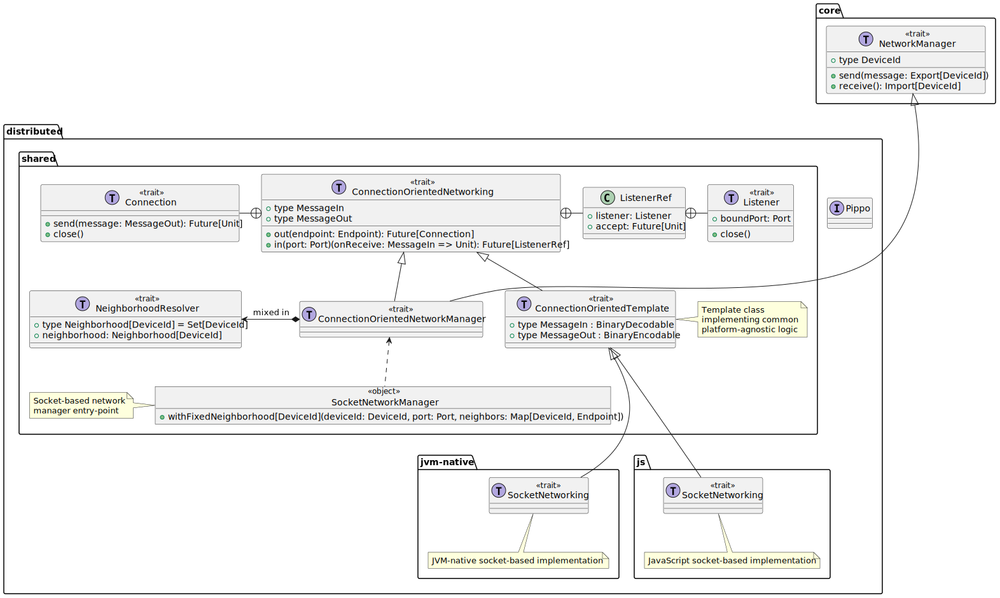

<!-- _class: invert -->

# Towards a **cross-platform**, **polyglot** implementation of _Aggregate Computing_ in ScaFi3

Luca Tassinari

<div class="smaller">

25/03/2025

<!--[_<ins>Link to ??? &#x2197;</ins>_](???)-->

</div>

---

## Motivations

- Aggregate Computing span heterogeneous devices and platforms 
- Several implementations of AC exist for different programming languages to:
  - target different platforms and environments;
  - leverage unique strengths of the host programming languages;

However:

- Each of these were developed from scratch, with no code reuse and compatibility in mind;
- No common framework led to fragmentation.

---

<div class="block">
  <div class="block-title">Goal</div>
  Investigate the feasibility of building a framework capable of targeting multiple   platforms while offering interoperability with other languages.
</div>

In particular the work focuses on:

- architectural design of a portable, interoperable layer for Aggregate programming, preserving core abstractions and full code reuse.
- interoperability and distribution strategies enabling seamless data exchange and collective execution across heterogeneous devices and language runtimes;
- evaluation of performance, API idiomaticity, and maintenance effort.

$\Rightarrow$ Scala 3 as the perfect fit to model AC abstractions and model in a strongly typed internal DSL.

---

#### Scala 3 compilation targets

- **JVM** (desktop, server, Android) \& _Java_ interop;
- **JS** via Scala.js:
  - Supported platforms:
    - Web (browser);
    - Node.js;
    - WebAssembly (experimental).
  - _JavaScript_ interop via annotations, indirectly supporting _TypeScript_;
  - Mature ecosystem.
- **Native** via Scala Native:
  - Supported platforms:
    - `x86-64` and `aarch64` on Linux, macOS and Windows;
    - experimental 32-bit support;
    - suitable for SoC-based IoT devices but <ins>not</ins> microcontrollers;
  - _C_ interop via annotations;
  - Growing ecosystem maturity, limited toolchain support.

ADD PRO AND CONS

---

### Contribution

The contribution of this thesis span three main axes:

1. **Add a cross-platform _distribution_ module;**

2. Add support for a general _cross-platform_ and _polyglot_ serialization binding;

3. Add a _cross-platform_, _polyglot_ library abstraction layer.

---

#### Distribution module

<div class="cols">
<div class="flex-3">

- Technology: _stream_, _TCP_-based _connection-oriented sockets_;
  - Each device is bound to a specific _endpoint_ (IP + port);
  - Point-to-point connections between neighbors;
  - Neighborhood is statically _fixed_ at initialization but can be extended in the future with dynamic discovery strategies;
- Support for multiple platforms: _JVM_, _JS_ (Node.js), _Native_;
  - _JVM_ + _Native_ support via Java Standard _sockets_ library;
  - _JS_ support via _Node.js net_ module using Scala.js type facades;
  - **Implications**:
    - shared code cannot perform blocking operations;
    - all the API is designed to be asynchronous and non-blocking using Futures;
    - the primary goal: write as much shared code as possible, minimizing platform-specific implementations.

</div>
<div class="flex-1">


</div>
</div>

---

<div class="smaller">

Simplified class diagram of the socket-based distribution module:

</div>

<div class="full-image">



</div>

---

An example of Scala.js facade over the Node.js `Net` class to allow interoperability with Node.js networking APIs:

```scala
@js.native
@JSImport("net", JSImport.Namespace)
object Net extends js.Object:

  /** A factory function which creates a new Socket connection. */
  def connect(port: Int, host: String): Socket = js.native

  /** A factory function which creates a new TCP or IPC server. */
  def createServer(connectionListener: js.Function1[Socket, Unit]): Server = js.native
```

---

### Contribution

The contribution of this thesis span three main axes:

1. Add a cross-platform _distribution_ module;

2. **Add support for a general _cross-platform_ and _polyglot_ serialization binding;**

3. Add a _cross-platform_, _polyglot_ library abstraction layer.

---
